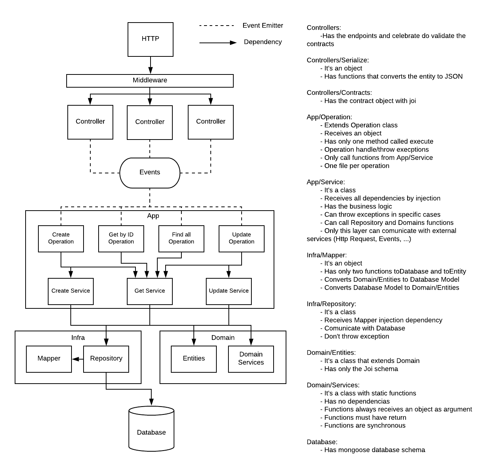

# Challenger!

Hi! My name is Marcio, and this is a simple project with NodeJs.

This project was created to exemplify how i have been evolving during the last few months.

The code consists in an API that allows a "manager" to save users information and cities.

Ok, but how can you run this code? 
### Running the code local machine

1. First you should install the dependencies with `npm install`
2. Run the docker-compose up with `docker-compose -f "docker-compose.yml" up -d --build` to up mongodb database
3. Run the application in development mode with `npm run dev`
4. Access `https://localhost:3000` and you're ready to go!

### Consuming API

To consume the API you can use any software you want, such as Postman. I really recomend you to use [Insomnia](https://insomnia.rest/download), wich
is pretty similar to Postman. Using Insomnia you can import the file "Routes.json", simplifying your testing.

### Routes

- USER 

1. Create user - POST - api/user
2. Get all users - GET - api/user
3. Get user by name - GET - api/user/name/:name
4. Get user by id - GET - api/user/id/:id
5. Update user name by id - PATCH - api/user/id/:id
6. Delete user by id - DELETE - api/user/id/:id

-CITY

1. Create city - POST - api/city
2. Get all cities - GET - api/city
3. Get city by name - GET - api/city/name/:city
4. Get city by id - GET - api/city/state/:state
5. Delete city by cep - DELETE - api/city/cep/:cep

## Microservice Infrastructure
I choose to build and organize the application using an infraestructure that allows dependency injection to be implemented. Once you use
dependency injection, what was based in containerization provided by Awilix, unit tests become very easy to be created. You can have an idea about the infraestructure analizing the image bellow:

Note that i decide to call repository directly from operations and the mapper was replaced by a serializer. Moreover, the database is 
protected by a validator middleware that prevents unknow fields to be saved.

## Scripts

The Api provides a collection of npm scripts that can help you. You can run them with `npm run <script name>`:

- `dev`: Run the application in development mode
- `start` Run the application in production mode (prefer not to do that in development)
- `lint`: Lint the codebase
- `test:unit`: Run all unit tests
- `audit`: Verify for package vulnerabilities
- `coverage`: Run the unit tests and generate code coverage for them, the output will be on `coverage` folder
## Techs

The most important tecnologies used on this project can be found at: 

- [Node v12.18+](http://nodejs.org/) JavaScript runtime built on Chrome's V8 JavaScript engine.
- [Express](https://npmjs.com/package/express) Fast, small, robust tooling for HTTP servers
- [Awilix](https://www.npmjs.com/package/awilix) For dependency inversion!
- [Joi](https://www.npmjs.com/package/joi) Used for create Schemas and Validations.
- [Morgan](https://www.npmjs.com/package/morgan) HTTP request logger middleware for node.js
- [Winston](https://www.npmjs.com/package/winston) A simple and universal logging library with support for multiple transports
- [Nodemon](https://www.npmjs.com/package/nodemon) Pretty cool to reboot the microservice once you make any changes in your code.
- [ESLint](https://www.npmjs.com/package/eslint) Usefull to verify identation and other sintax patterns.
- [Mongoose](https://www.npmjs.com/package/mongoose) MongoDB object modeling tool designed to work in an asynchronous environment.
- [Chai](https://www.npmjs.com/package/chai) An assertion library, similar to Node's built-in assert
- [Mocha](https://www.npmjs.com/package/mocha) JavaScript test framework for Node.js 

You can check package.json for more!
